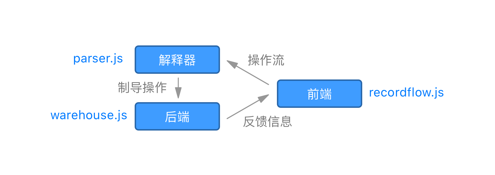

## 设计

### 概念设计

RecordFlow，即记录流，是一个愉快的NoSQL数据库。（以下也称RecordFlow为RF）

RecordFlow主要的目标是优雅而高效的语法（见“[语法设计](#语法设计)”）、轻量而便捷的分发（见“[安装](#安装)”）。RF由概念、设计、实现到诞生的每一个阶段都围绕这个目标而展开。

RecordFlow将记录作为数据基本单位，记录以流的形式逐条流入，在RF中逐条处理。所有RF的操作的中心都是记录。

### 词法设计

RF的数据单位分为三种。

#### 记录项

记录项（record_item）是最小的数据单位，是一个键值对。其概念类似关系数据库的一个字段。如下：

```
name: value
```

`name`为该标识该记录项的名称，`value`为该记录项所包含的值，冒号隔开。

#### 记录

一条记录（record_entity）由一个或多个记录项组成，是一个字典。其概念类似关系数据库的一条记录。的如下：

```
{record_item_1, ..., record_item_n}
```

`record_item_n`为n个属于该记录的记录项，记录项间使用逗号隔开。

例如：

```
{price: 650}
{price: 1000, name: 'Odyssey', model: 'AN938P'}
```

#### 记录集合

记录集合（collection_entity）是最大的数据单位，是由零个或多个记录组成的集合。其概念类似关系数据库的一张表。记录集合用唯一集合名所标识，例如：

```
cars
default
```

### 语法设计

RF共有四种操作，覆盖到增删改查（CRUD）的每一方面，可以在一次操作中实现关系数据库中除连接查询之外相对应的大部分功能。

RF共有两大操作符：

1. `->`  即右箭头，表示数据的查询与删除操作。
2. `<-`  即左箭头，表示数据的插入与更新操作。

#### 插入

插入（insert）操作向一个记录集合中插入一条记录。如下：


```
collection_entity <- record_entity
```

例如：

```
default <- {price: 650}
default <- {price: 1000, name: 'Odyssey', model: 'AN938P'}
```

#### 查询

查询（query）操作返回一个记录集合中所有满足指定条件的记录集。

其中，记录集（record_map）是记录集合的子集，映射来自记录集合的零条或多条记录。
查询操作语法如下：

```
collection_entity -> record_filter_entity
```

其中记录过滤器（record_filter_entity）用来指定查询的条件，常用的比较过滤器有：

```
{name = value}
{name < value}
{name > value}
```

查询操作示例：

```
default -> {name = 'Odyssey'}
default -> {price > 700}
```

#### 更新

更新（update）操作将从记录集合中查询出的记录集与给定记录归并更新。如下：

```
collection_entity -> record_filter_entity <- record_entity
```

该操作左部与查询操作一致，生成一个记录集。该记录集中的每条原记录与右部新记录（record_entity）归并（merge），而更新记录项。

归并的具体机制如下：

对于新记录的每个记录项

- 若原记录含有同名记录项，则将原记录项的值更新为新记录项
- 若原记录不含同名记录项，则将新记录项插入原记录。

更新操作示例：

```
default -> {price > 600} <- {quality: 'high'}
default -> {name = 'Odyssey'} <- {price: 700}
```

#### 删除

删除（drop）操作将从记录集合中查询出的记录集删除。如下：

```
collection_entity -> record_filter_entity ->
```

该操作左部与查询操作一致，生成一个记录集。右部右箭头后内容为空，表示删除。例如：

```
default -> {model = 'A1238P'} ->
default -> {price < 700} ->
```

## 实现

RF采用 `前端`、`解释器` 、 `后端` 分立的架构：

RF整体以 Node.js 为开发平台，JavaScript为开发语言实现。

RF解释器使用Jison作为词法、语法、语义分析器。Jison是基于JavaScript实现的Flex（Lex开源实现）与Bison（Yacc开源实现）。

### 前端

RF前端是一个命令行程序，有 `直接` 和 `REPL` （Read-Eval-Print-Loop，即时交互）两种工作模式。前端负责与用户交互、从文件系统或命令行读入操作流，并逐条递交至解释器。

#### 直接模式

RF在直接模式中读取一份存有所有操作序列的文本文件（推荐使用 `.rf` 做为扩展名），逐条解析，输出相关的结果提示，之后退出。

直接模式的命令格式为：

```
recordflow file_name
```

例如：

```
recordflow test.rf
```

#### REPL

不带参数，直接运行RF即可进入即时交互模式：

```
recordflow
<- recordflow 0.1.1 ->

:
```

交互模式下，在 `:` 提示符之后逐条输入操作，回车即可立即执行并返回结果信息：

```
: default
rf.collection: 0 records in collection 'default'.

: default <- {name: 'Max', grade: 88}
rf.record.insert: record with 2 items inserted.
{name: 'Max', grade: 88}

: default -> {grade > 40}
rf.record_set: 1 records in record_set.
[{name: 'Max', grade: 88, _id: ...c72c}]

: default ->
rf.collection.drop_all: 1 records dropped.
```

按下 `Ctrl-C` 即可退出RF。

### 后端

后端由自主开发的记录仓库（warehouse）所实现。

#### 自动持久化

在每次RF执行操作前前自动读入所有记录集合，退出之前自动向工作目录写入所有记录集合。

其中写入的具体实现是向 `rf_rec` 目录写入以JSON形式序列化的记录集合。

#### 信息反馈

后端在处理完记录操作之后，将结果信息以文本的形式反馈至前端。

#### 记录操纵接口

RF的记录仓库拥有独立的操纵接口（API），与前端和解释器相解耦。开发者可以在 JS 中直接调用此接口进行 NoSQL 数据库开发。例如：

```javascript
const warehouse = require('../warehouse/warehouse');
const filter = require('../warehouse/filter');
const {record, record_item} = require('../warehouse/record');

warehouse.load();
let rec = record.build();
rec.appendItems([new record_item('price', 800),new record_item('model', 'A1238P')]);
warehouse.collection('default').append(rec);
let all_rec = warehouse.collection('default').record(filter.all());
console.log(all_rec.toString());
let gt_rec = warehouse.collection('default').record(filter.gt('price', 600));
warehouse.save();
```

### 安装

RF的一个基本出发点就是易分发性。在安装 Node.js 的、接入互联网的机器上，只需运行以下命令，即可在5秒内完成安装：

```
npm i -g recordflow
```

安装完成后，在任意位置，即可输入 `recordflow ` 命令进入REPL测试RF：

```
recordflow
<- recordflow 0.1.1 ->

:
```

## 展望

现阶段RecordFlow所实现的功能跟顶级 No-SQL 或 RDBMS 相比还非常有限，架构组织存在不太合理的地方，以后的开发将注重以下几个方面：

### 信息系统重构

目前记录操作的信息反馈系统，内聚偏低、耦合偏高，实现时使用了一些类的私有函数，难于扩展。需要一次完整的重构来解决这些遗留问题。

### 过滤器完善

实现过滤器组，增加逻辑过滤器，增加更多函数过滤器，实现项名变换器。例如：

```
default -> {price > 600, quality} -> {weight > 3000}
Students -> {age >= 18 & sex = 0 | gpa < 3.5} -> {name}
default -> {:last} -> {name}
```

### 多记录插入

同时插入多个记录：

```
Students <- [{name: 'Max', id: 1}, 
			 {name: 'Chloe', id: 2},
			 {name: 'Rachel', id: 3},
			 {name: 'Warren', id: 4}]
```

### 操作嵌套

允许动态记录嵌套，进一步提高单句操作表达能力：

```
(Students -> {name = 'Max'}) <- (Students -> {name = 'Chloe'} -> {gpa})
Students -> {grade >= (Students -> {grade} -> {:average}) }
```

> Copyright 2018 E-Tiger Studio